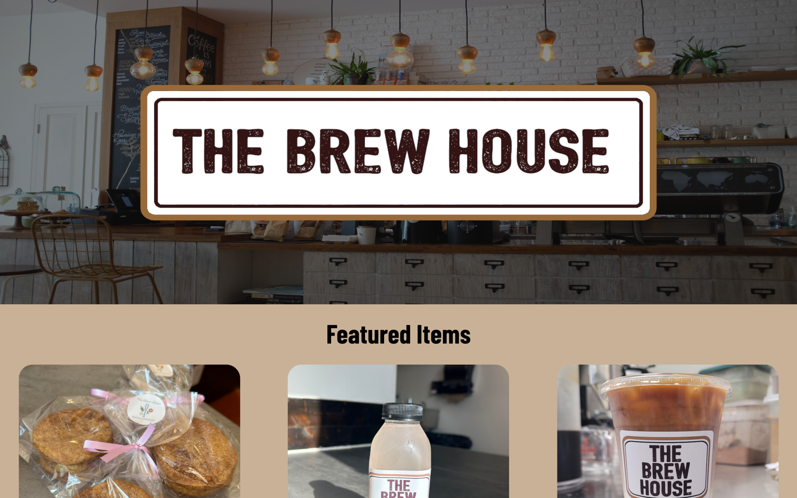

<div align="center">

# ☕ The Brew House

### A practice build — single-page site for a neighborhood coffee shop in La Puente, CA

A clean, mobile-first landing page for The Brew House coffee shop. This was an early **practice project** — I built it to sharpen my Next.js, TypeScript, and MUI skills by shipping a small, real-world single-page site end to end.

[](https://brewhouselp.vercel.app)




</div>

## Features

- **Hero & branding** — full-bleed photography of the shop with the Brew House sign front and center
- **Featured items carousel** — a responsive [Splide](https://splidejs.com/) carousel highlighting menu items with photos
- **Responsive layout** — built mobile-first; looks right from phones to desktop
- **Social links** — quick paths to the shop's Instagram and contact info
- **Accessible components** — leans on MUI's accessible primitives for consistent, keyboard-friendly UI

## Tech stack

| Layer      | Choice                          | Why                                                              |
| ---------- | ------------------------------- | ---------------------------------------------------------------- |
| Framework  | Next.js (Pages Router)          | Fast static delivery and Vercel-native, zero-config deployment   |
| Language   | TypeScript                      | Type safety across components and props                          |
| UI         | MUI + Emotion                   | Accessible, themeable component system with the `sx` styling API |
| Carousels  | Splide + react-slick            | Lightweight, touch-friendly image carousels                      |
| Hosting    | Vercel                          | Automatic preview deploys on every push                          |

## Local development

```bash
# Prerequisites: Node.js 18+
npm install      # or: yarn / pnpm install

npm run dev      # start dev server on http://localhost:3000
npm run build    # production build
npm run lint     # ESLint (next lint)
```

## Image attributions

- Coffee shop image by Nafinia Putra on [Unsplash](https://unsplash.com/photos/Kwdp-0pok-I).
- Instagram icon by rawpixel.com on [Freepik](https://www.freepik.com/free-vector/instagram-vector-social-media-icon-7-june-2021-bangkok-thailand_18246125.htm).
